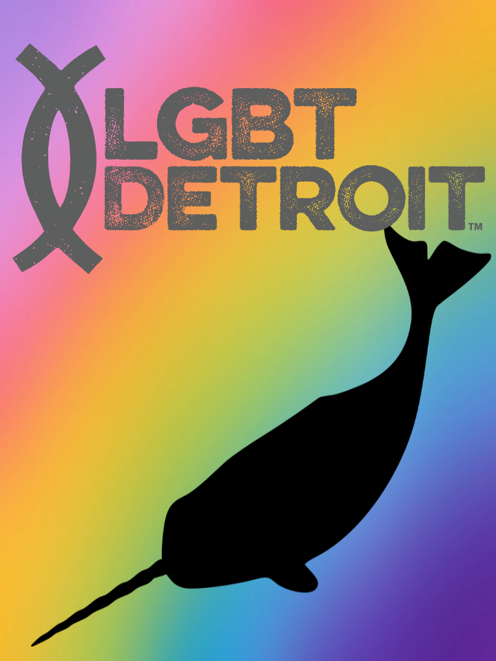
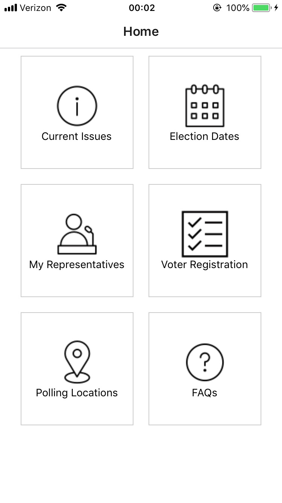

# Non-Conformist Narwhals

App development for the 2019 oSTEM Hackathon.
The challenged product supports voter literacy through [LGBT Detroit](https://www.lgbtdetroit.org/).

## To test the app:
Download the [Expo Client](https://expo.io/) app to your mobile device.

If you haven't installed [yarn](https://yarnpkg.com/lang/en/docs/install/) or
[Expo client](https://docs.expo.io/versions/v35.0.0/get-started/installation/),
do that now. Expo recommends that Mac users also install
[Watchman](https://facebook.github.io/watchman/docs/install.html).

On your computer, clone this repository, and then `cd` to the directory.
```
$ git clone https://github.com/travigd/NarwhalApp.git
$ cd NarwhalApp
```

```
$ yarn start
```
(Note: this will also launch `$ expo start`.)

Scan the QR code using the phone's QR reader (likely the camera).
This will pull up the app development within Expo. If you're having issues with
LAN, try a tunnel connection.

<p align="center">
  
  
</p>
